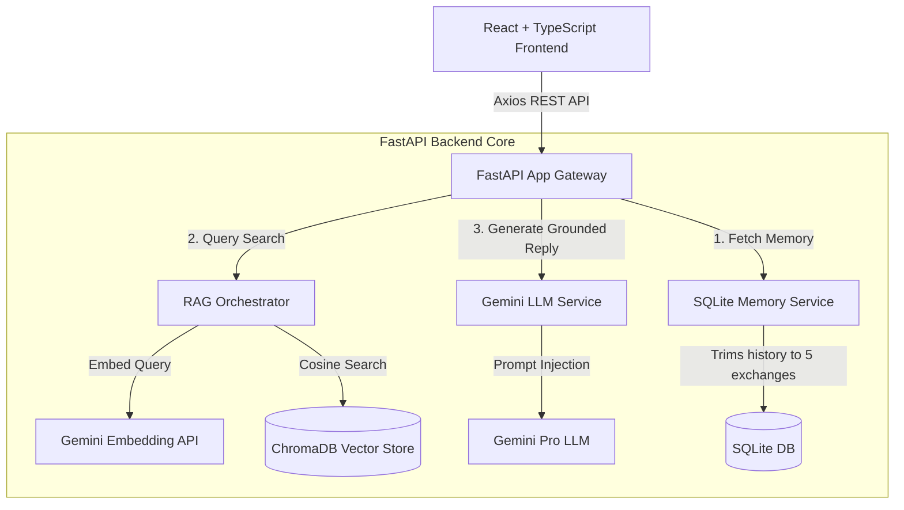

# AeroRAG // Production-Grade GenAI Chat Assistant

AeroRAG is a secure, high-performance, and grounded GenAI Chat Assistant implementing zero-hallucination **Retrieval-Augmented Generation (RAG)**. The application is built using a React, TypeScript, and Vite frontend paired with a FastAPI, ChromaDB, and SQLite backend, orchestrated by the Gemini API.

> [!NOTE]
> **Zero-Hallucination Guardrail**: This assistant is mathematically bounded by a cosine similarity threshold of **0.75**. If query relevance falls below this, the system halts generation and prompts a fallback message, bypassing the LLM to safeguard against hallucinations.

---

## 🏛️ System Architecture



---

## 📁 Repository Directory Structure

```text
RAG-BASED-AI-Assistant/
│
├── backend/
│   ├── api/
│   ├── data/
│   │   └── docs.json                 # Knowledge base corpus sources
│   ├── models/
│   │   └── schemas.py                # Pydantic schemas for REST payload validation
│   ├── repositories/
│   │   └── sqlite_db.py              # SQLite context manager & connections
│   ├── services/
│   │   ├── embedding_service.py      # Gemini embedding generator with exponential backoff retries
│   │   ├── llm_service.py            # Gemini text generation & token tracer
│   │   ├── memory_service.py         # 5-exchange SQLite conversation history slider
│   │   └── rag_service.py            # RAG pipeline with similarity threshold filters
│   ├── vectorstore/
│   │   └── vector_store.py           # ChromaDB persistent collection & text sliding-window chunker
│   ├── tests/
│   │   └── test_backend.py           # Pytest integration tests (10 mandatory scenarios)
│   ├── config.py                     # Strongly typed environment settings via Pydantic
│   ├── main.py                       # FastAPI entrypoint, middlewares, and startup seeder
│   ├── .env                          # Local credentials (API keys, ports)
│   ├── .env.example                  # Environment template configurations
│   └── requirements.txt              # Backend pip dependencies
│
├── frontend/
│   ├── src/
│   │   ├── components/
│   │   │   ├── MessageBubble.tsx     # Markdown renderer, telemetry metadata, copy trigger
│   │   │   ├── Toast.tsx             # Pop-up notification toast for validation/connection issues
│   │   │   └── TypingIndicator.tsx   # Glassmorphic pulse animation for active operations
│   │   ├── services/
│   │   │   └── api.ts                # Axios gateway interceptor and network client
│   │   ├── tests/
│   │   │   └── App.test.tsx          # Jest / RTL component test suite
│   │   ├── types/
│   │   │   └── index.ts              # Strongly typed application models
│   │   ├── App.tsx                   # Dashboard workspace, multi-session, local-cache sync
│   │   ├── index.css                 # Glassmorphism theme, styling overrides, scrollbar
│   │   └── main.tsx                  # React DOM mount bootstrapper
│   ├── index.html                    # Entry document, viewport configurations, SEO titles
│   ├── package.json                  # Frontend node packages
│   ├── postcss.config.js             # PostCSS compilation
│   ├── tailwind.config.js            # Tailwind custom colors & typography extend
│   ├── tsconfig.json                 # TypeScript compiler setup
│   ├── vercel.json                   # Vercel SPA rewrites & cleanUrls
│   └── vite.config.ts                # Vite config & dev API reverse proxy
│
├── Dockerfile                        # Multi-stage production container
├── docker-compose.yml                # Developers local orchestration compose file
├── render.yaml                       # Render blueprint deployment file
└── README.md                         # Complete documentation manual
```

---

## ⚙️ Environment Configuration

Generate a copy of `backend/.env` matching the blueprint in `backend/.env.example`:

| Environment Variable | Description | Default Value |
| :--- | :--- | :--- |
| `GEMINI_API_KEY` | Generative AI Access Key (from Google AI Studio) | *Required* |
| `SIMILARITY_THRESHOLD` | Hard minimum cosine similarity for matches | `0.75` |
| `TOP_K` | Maximum document chunks to pass into context window | `3` |
| `CHUNK_SIZE` | Text chunk character width for slicing | `500` |
| `CHUNK_OVERLAP` | Sliding window character overlap | `50` |
| `CHROMA_PERSIST_DIR` | ChromaDB persistence folder path | `./data/chromadb` |
| `SQLITE_DB_PATH` | SQLite relational history path | `./data/chat_history.db` |
| `PORT` | Backend FastAPI port mapping | `8000` |

---

## 🚀 Quickstart Guide (Local Development)

### Prerequisites
- Python 3.10+
- Node.js 18+

### Step 1: Initialize Backend Services
```bash
cd backend
python -m venv venv
source venv/Scripts/activate # Windows
# source venv/bin/activate  # Unix/macOS

pip install -r requirements.txt
```
Copy `.env.example` to `.env` and fill in your `GEMINI_API_KEY`.
```bash
cp .env.example .env
```
Run FastAPI server:
```bash
uvicorn main:app --reload --port 8000
```
FastAPI server will index `data/docs.json` automatically on start and run on `http://localhost:8000`.

### Step 2: Initialize Frontend Application
```bash
cd ../frontend
npm install
npm run dev
```
Open your browser at `http://localhost:5173`. Vite will forward `/api` requests to the local Python gateway automatically.

---

## 🐳 Docker Orchestration

Build and boot the entire stack (FastAPI backend + React frontend) concurrently with live hot reloading:
```bash
docker-compose up --build
```
- Backend Gateway: `http://localhost:8000`
- Frontend Dashboard: `http://localhost:5173`

---

## 📝 API Contract Specifications

### 1. Execute RAG Chat Transaction
- **Path**: `POST /api/chat`
- **Payload Validation**:
  ```json
  {
    "sessionId": "usr_session_9921",
    "message": "What classification level is customer source code?"
  }
  ```
- **Response Format**:
  ```json
  {
    "reply": "All company source code is categorized as Confidential company data under corporate security guidelines...",
    "tokensUsed": 118,
    "retrievedChunks": 1,
    "similarityScores": [0.892]
  }
  ```

### 2. Operational Healthcheck
- **Path**: `GET /health`
- **Response Format**:
  ```json
  {
    "status": "healthy"
  }
  ```

---

## 🧪 Running Diagnostic Tests

### Running Backend Pytests (10 Scenarios)
Execute Pytest integration suite covering threshold filters, missing keys, timeout, and database corruptions:
```bash
cd backend
pytest -v
```

### Running Frontend Vitest Component Tests
```bash
cd frontend
npm run test # runs jest / vitest component suites
```

---

## 🎯 Grounded RAG Generation Flow

1. **Query Embedding**: The user query is vectorized via the Gemini `text-embedding-004` model.
2. **Cosine Match Search**: ChromaDB conducts a cosine search against indexed document chunks.
3. **Similarity Check**: Matches are scored. Chunks with cosine similarity score $< 0.75$ are discarded.
4. **Fallback Evaluator**: If 0 matches remain, Uvicorn stops the generation pipeline immediately, returning the fallback text: *"I could not find enough information in the knowledge base to answer this question."* without calling the LLM.
5. **Context assembly**: Grounded context is compiled alongside SQLite session history (retaining only the latest 5 user-assistant exchanges).
6. **LLM Generation**: The compiled grounded prompt is dispatched to `gemini-1.5-flash` to return the response.

---

## ☁️ Deployment Configurations

### Frontend (Vercel)
The directory contains a custom [vercel.json](file:///c:/Users/VENKY/Documents/Assesments/RAG-BASED-AI-Assistant/frontend/vercel.json) setting up SPA routes.
1. Connect your Github Repository to Vercel.
2. Select Root Directory as `frontend`.
3. Build Command: `npm run build`.
4. Output Directory: `dist`.
5. Environment Variable: Set `VITE_API_BASE_URL` to your Render API address.

### Backend (Render)
The repository contains [render.yaml](file:///c:/Users/VENKY/Documents/Assesments/RAG-BASED-AI-Assistant/render.yaml) enabling easy Render blueprints deployment.
1. Create a "Blueprint" service inside Render dashboard.
2. Connect your Github Repository. Render parses `render.yaml` to provision SQLite and Chroma persistent volumes, set custom environment variables, and map the port gateway automatically.
